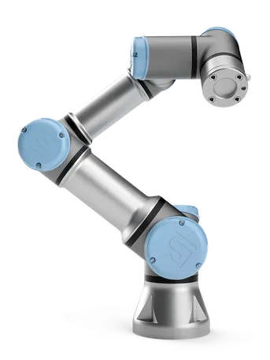
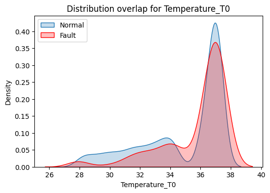
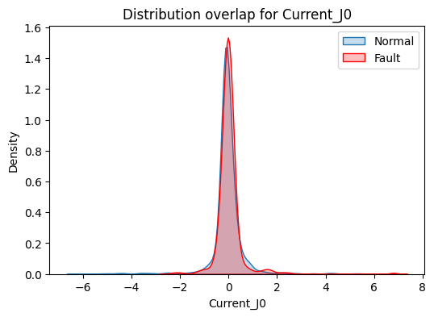

# RoboFault: UR3 Robot Fault Detection & Analysis  

## Project Overview  
RoboFault is a **data analysis and fault detection project** for the **Universal Robots UR3** collaborative robot.  
We aim to understand conditions leading to:  
- **Protective Stops** → Safety-triggered halts to prevent damage.  
- **Grip Loss Events** → Robot fails to hold objects properly.  

This README summarizes:  
- The **data sources & features**  
- **Preprocessing steps** for missing values & imbalance  
- **EDA & feature engineering**  
- **Statistical thresholding & overlap analysis**  
- **Fault event characterization & detection results**  

---

## Robot Photo and description
The Universal Robots UR3 is the smallest and lightest cobot in the UR range. A compact 11 kg robot with a load capacity of up to 3 kg. With a range of 500 mm, a precision of 0.1 mm, and 360-degree rotation on all joints, the robot is perfect for automating manual tasks.

  

---

## Dataset Description  

**Source:** UR3 robot sensor logs (time-series data).  

| Feature Type           | Examples                        | Description                             |
|------------------------|----------------------------------|-----------------------------------------|
| Time & Cycles           | Timestamp, Cycle                | Logging time & operation grouping        |
| Currents                | Current_J0…J5                   | Current drawn by each joint (J0–J5)       |
| Speeds                  | Speed_J0…J5                     | Angular velocities of each joint          |
| Temperatures            | Temperature_J0…J5, T0           | Thermal load readings for joints & tool   |
| Tool Current            | Tool_current                    | Current drawn by the robot’s gripper      |
| Fault Indicators        | Robot_ProtectiveStop, grip_lost  | Binary labels: 1 = fault, 0 = normal      |

Data properties:  
- **Cycle-based logging** Each cycle = one robot operation.  
- **Fault Imbalance**  Only ~3–4% of events are faults, making detection harder.  
- **Multiple signals**  Currents, speeds, temperatures, tool current.  

---

##  Data Preprocessing  

### 1. Handling Missing Values  
We compared:  
- **Linear Interpolation (final choice)** → Simple, per-cycle imputation.  
- **KNN Imputation** → Similarity-based filling.  
- **MissForest Imputation** → ML-based iterative imputation.  

**Reason for Linear Interpolation:**  
- Data is a time series with a few nulls → simple & efficient.  
- Fault indicators imputed using **mode per cycle**.
  
---

## Exploratory Data Analysis (EDA)  

We explored the dataset in **five main steps**:

### 1. Data Distribution  
- **Currents:** Mostly stable, few spikes → linked to faults.  
- **Speeds:** Mostly near zero → slow movement, sudden bursts before faults.  
- **Temperatures:** Gradual rise, J4 & J5 hottest → possible cooling inefficiency.  
- **Tool Current:** Instability = fault risk factor.  

---

### 2. Correlation Analysis  
- **Strong positive correlations** → all temperatures rise together.  
- **Moderate correlations** → currents & speeds.  
- **Weak correlations** → tool current is independent.  

---

### 3. Fault vs Normal Segmentation  
We analyzed periods with:  
- **Protective Stops (5–11s)** → sudden halts, not always overheating.  
- **Grip Loss (9–18s)** → unstable tool current.  
- **Normal cycles (200–900s)** → long stable operation.  

---

### 4. Data Overlap Problem  
- Fault vs normal distributions **overlap heavily**.  
- Example: Temperature values in faults & normal periods are very similar.  
- **Implication:** Thresholds alone = many false alarms.  

  

  

---

### 5. Summary of EDA  
- J1 & J2 → highest load → main fault triggers.  
- J4 & J5 → heat lag → cooling inefficiency.  
- Tool current instability → strong grip loss predictor.  
- High overlap → need advanced detection methods.  

---

## Feature Engineering  

We derived additional features for better fault analysis:  

| Feature Group           | Description & Purpose                              |
|-------------------------|----------------------------------------------------|
| Absolute Values         | |currents| & |speeds| → magnitude focus             |
| Power Features          | Current × Speed → load vs fault risk                |
| Sudden Change Features  | Acceleration of speed/current → abrupt events       |
| Current Asymmetry        | Forward vs backward imbalance detection            |
| Thermal Lag             | Time delay between power & temperature rise         |

---

## Splitting & Statistical Thresholds  

We **split the dataset** per joint & fault type:  
- J0–J5 analyzed separately.  
- Protective stop vs grip loss events isolated.
- 
**Important:**  
All **threshold determination** and **overlap analysis** results below are **based on Joint 0**, which we analyzed separately to study its behavior in detail.

### Threshold Determination  
We used:  
- **Youden's Index** on ROC curves for optimal cutoffs.  
- **Quartile analysis** → fault probability across temperature/speed ranges.  

Example (Joint 0):  
- Temp > 34.2°C → Higher fault risk.  
- Speed < -0.004 → Fault-prone events.  

---

## Overlap & Density Analysis  

We applied:  
- **Kernel Density Estimates (KDEs)** → fault vs normal distributions.  
- **Kolmogorov-Smirnov tests** → statistical differences.  

Findings:  
- Heavy overlap → many false positives at single thresholds.  
- Faults = only 3–4% of data → imbalance worsens precision.    

---

##  Fault Event Characterization  

We measured:  
- Duration of faults (5–18s).  
- Number of consecutive faults.  
- Normal vs fault cycle lengths.  

Findings:  
- Faults = short disruptions.  
- Normal cycles = long stable operations.  
 
---

## Outlier Detection  

- Counted statistical outliers per cycle.  
- Fault cycles → >200 outliers.  
- Normal cycles → <100 outliers.  

**Outlier sources:**  
- Joint speeds (J2, J3, J5) → biggest anomaly contributors.  
- Tool current spikes → strong grip loss indicators.  

---
## Additional Key Insights from Joint 0 Analysis  

For **Joint 0**, which we analyzed separately for **threshold determination**, we observed the following:  

- **Temperature** and **Speed** have the most significant influence on fault occurrence.  
- Fault events appear most frequently at **high temperatures (~36°C)** and **high vibration speeds**.  
- However, **thresholds alone lack predictive precision** because the **data overlap** between fault and normal periods is very high.  
- The **data imbalance** (~3–4% faults) further reduces precision even when **recall remains acceptable**.  
 

